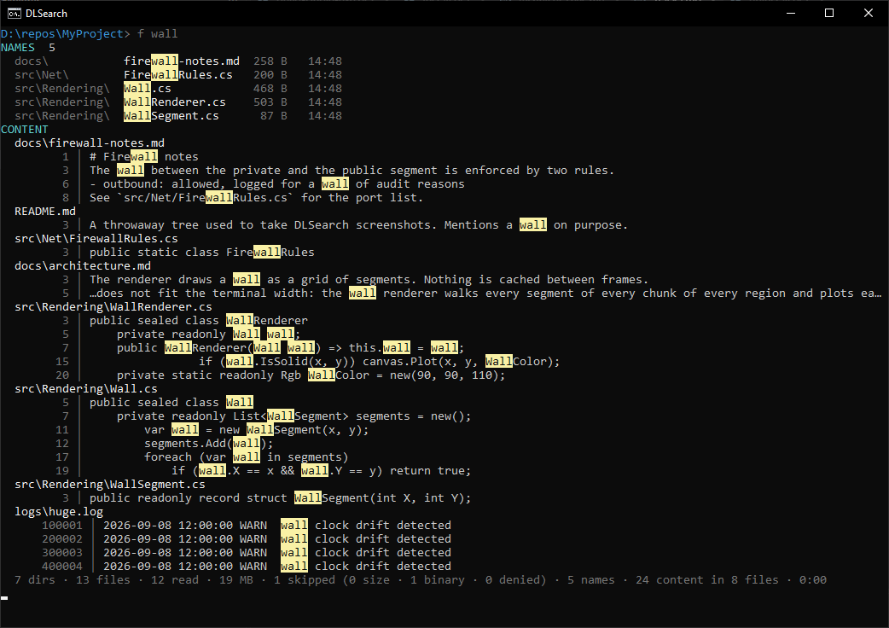
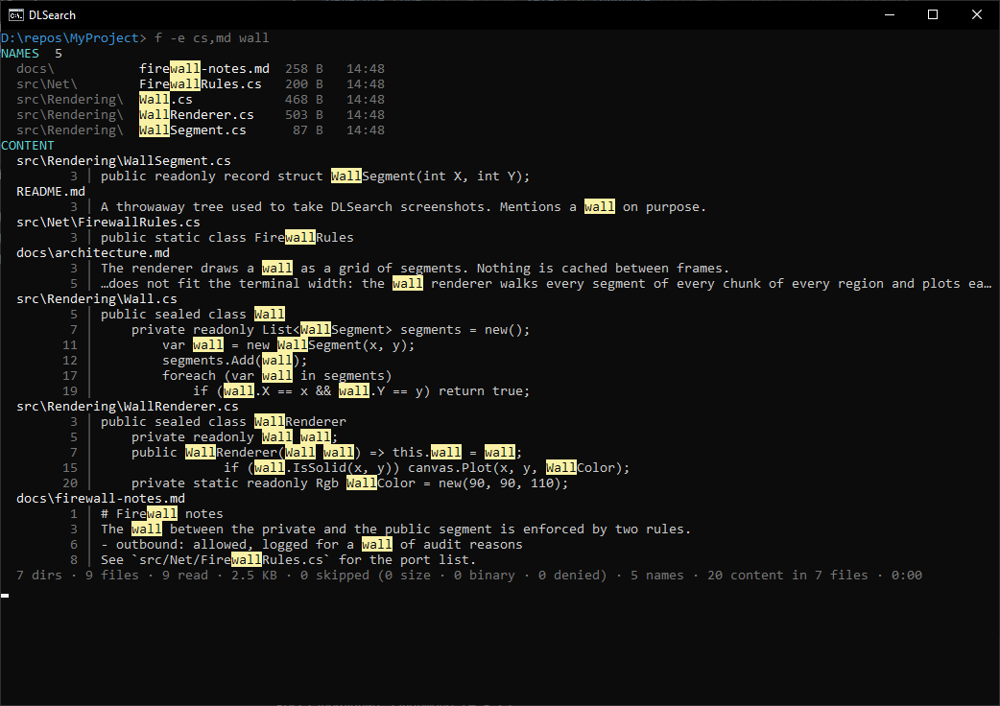
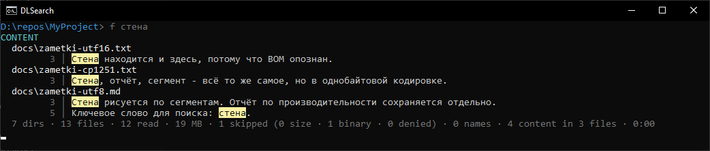
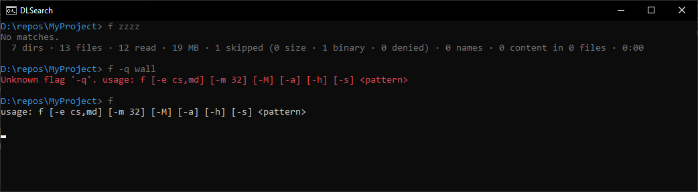

# DLSearch

Поиск по имени файла и по содержимому, запускаемый прямо из адресной строки проводника командой `f`.

Утилита безындексная: нет службы, нет фонового процесса, нет кэша на диске. Процесс живёт ровно один запрос, работает в памяти и завершается. Результат всегда актуален, установка — копирование одного `.exe`, удаление — его удаление.



Корень поиска — рабочий каталог процесса. Проводник передаёт открытую папку, поэтому `f wall` в адресной строке ищет по текущему дереву.

## Установка

Скрипты сборки и установки лежат в родительском каталоге рабочей копии, рядом с репозиторием:

```powershell
..\build-single-exe.ps1 -OutputDir 'P:\Program Files\DLSearch'
..\install.ps1 -TargetDir 'P:\Program Files\DLSearch'
```

`build-single-exe.ps1` публикует self-contained single-file `f.exe`. `install.ps1` добавляет каталог в пользовательский `PATH` (`HKCU\Environment`, без прав администратора) и рассылает `WM_SETTINGCHANGE`, поэтому уже открытый проводник видит изменение без перезапуска. Скрипт идемпотентен.

Удаление — `..\uninstall.ps1 -TargetDir 'P:\Program Files\DLSearch'`: убирает ровно эту запись из `PATH`.

## Использование

```
f [-e cs,md] [-m 32] [-M] [-a] [-h] [-s] <pattern>
```

Запрос берётся буквально, целиком, вместе с пробелами: `f wall paper` ищет подстроку `wall paper`, кавычки не нужны. Первый аргумент без `-` начинает запрос, всё после него флагами не считается; `--` тоже завершает разбор флагов.

| Флаг | Умолчание | Действие |
|---|---|---|
| `-e cs,md` | не задан | Ограничить поиск расширениями. Точка необязательна, регистр не важен. |
| `-m 32` | 32 МБ | Порог размера файла для чтения содержимого. |
| `-M` | выключен | Снять порог размера полностью. |
| `-a` | выключен | Не исключать мусорные каталоги (`.git`, `node_modules`, `bin`, `obj`, `.vs`, `packages`). |
| `-h` | выключен | Включить в обход скрытые и системные файлы. |
| `-s` | выключен | Учитывать регистр (отключает smart-case). |

Регистр по умолчанию обрабатывается по правилу smart-case: запрос без заглавных букв ищется без учёта регистра, запрос хотя бы с одной заглавной — с учётом.

### Фильтр по расширениям

`-e` применяется и к блоку имён, и к блоку содержимого.



### Кириллица и кодировки

Файлы без BOM обыскиваются на уровне байтов сразу двумя представлениями запроса — UTF-8 и CP1251, — поэтому кириллица находится и в современных файлах, и в старых однобайтовых, без попыток определить кодировку. Файлы с BOM UTF-16 декодируются и ищутся как текст.



### Отсутствие результатов и ошибки



## Вывод

Сначала блок `NAMES` — совпадения по именам файлов с размером и датой; он не требует чтения файлов и печатается по завершении обхода дерева. Затем блок `CONTENT` — совпадения по содержимому, сгруппированные по файлам, потоком по мере нахождения. Совпавшая подстрока подсвечивается; строка длиннее ширины терминала обрезается так, чтобы совпадение осталось видимым.

Последняя строка — статистика: каталоги, проверенные и прочитанные файлы, объём чтения, пропущенные с разбивкой по причинам (размер, бинарный, нет доступа), число совпадений и время.

Во время поиска в последней строке идёт индикатор прогресса: на фазе обхода — спиннер со счётчиками, после её завершения — полоса с процентом. `Ctrl+C` прерывает поиск: найденное остаётся на экране, статистика печатается с пометкой о прерывании. По завершении приложение ждёт нажатия любой клавиши, чтобы окно проводника не закрылось мгновенно; ожидание пропускается при перенаправлении ввода.

При перенаправлении вывода цвета и индикатор отключаются — в файл попадает чистый текст.

## Что утилита не делает

Индекса любого вида, фонового процесса и отслеживания изменений ФС нет. Содержимое бинарных форматов (PDF, DOCX, архивы) не извлекается. Регулярных выражений, логических операторов и масок в запросе нет, поиск буквальный и без морфологии. Ограничения времени поиска нет — выбор области лежит на пользователе. Целевая ОС — только Windows.

## Сборка и тесты

```powershell
dotnet build DLSearch.sln
dotnet test tests\DLSearch.Tests\DLSearch.Tests.csproj
```
